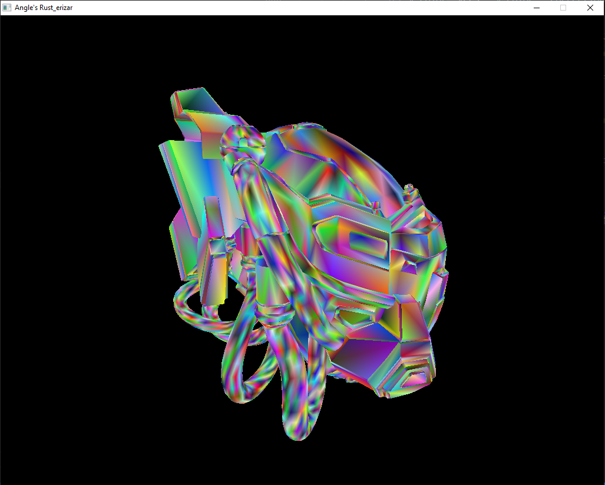
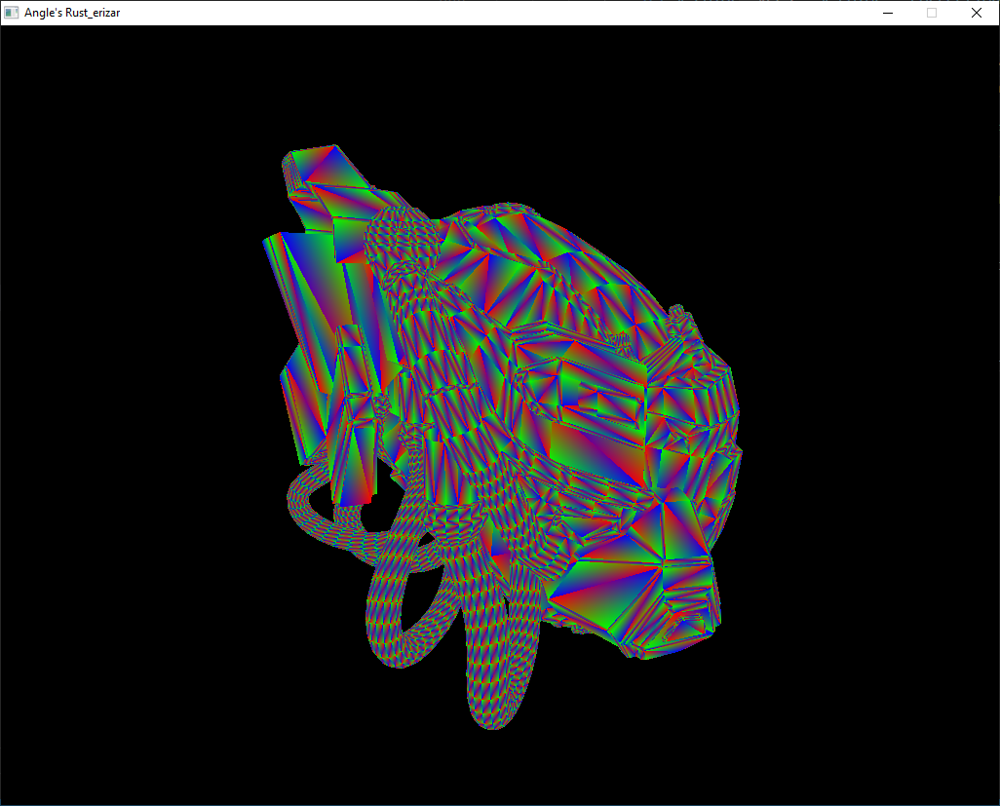

# Title
Name: Angel Donchev Angelov
BUas email: 211195@buas.nl
Personal Email : ang.don.ang@gmail.com

## Features
> Provide a detailed list of the features implemented
> Feel free to provide link to the code that implements te features. (in GitHub you can just click on a line of code and get the link to it)

### Models:
+ Basic glTF Model Loading
+ Frustum Culling

### Rendering:
+ Multithreaded Fragment Shader
    > Note: Textures don't work after I've implemented this, because I didn't have enough time to figure out a way to get around the borrow checker.
+ Textures
+ Samplers (ClampToEdge, Repeat, Mirror)
+ Clipping and Backface Culling
+ Proper Normals Rendering
+ Vertex Colors

### Render Modes:
+ Material Color
+ Vertex Color
+ Texture
+ Texture blended with Vertex Color
+ Normals
+ UVs
+ Barycentric
+ Depth
+ Aabb

## Showcase

### Images:
#### Picture of all Render Modes of the PBR Helmet:

- Texture:

- Textures + Vertex Colors

- Vertex Colors

- Barycentric coordinates

- AABBs

- Normals

- UVs

### Videos:
#### Render Modes Showcase

#### Multithreaded Sponza!

#### Basic Scene

#### Mesh Culling Showcase

#### Basic Geometry Scene

