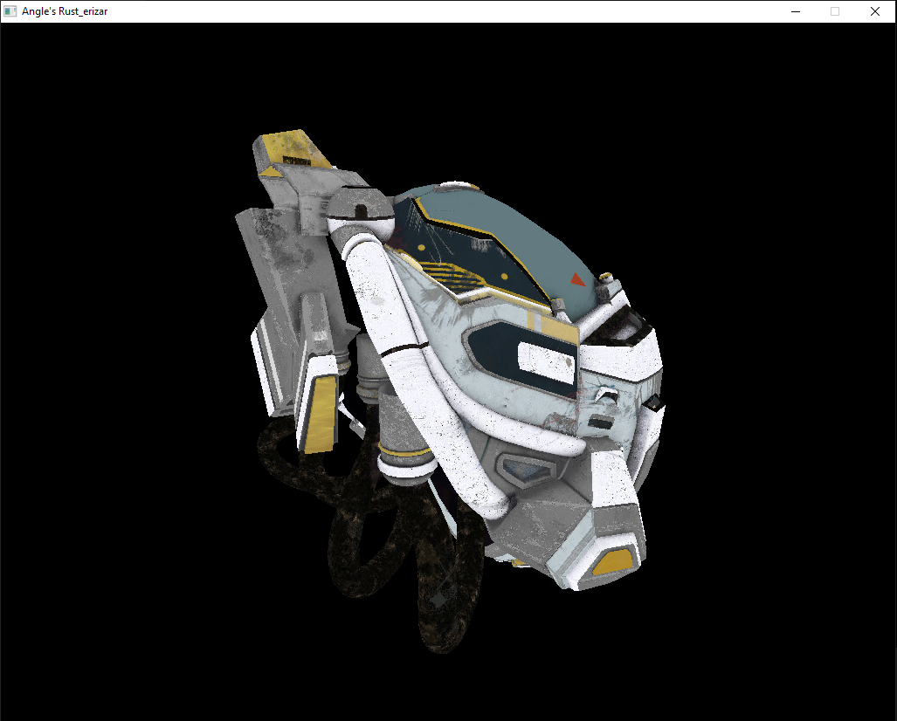
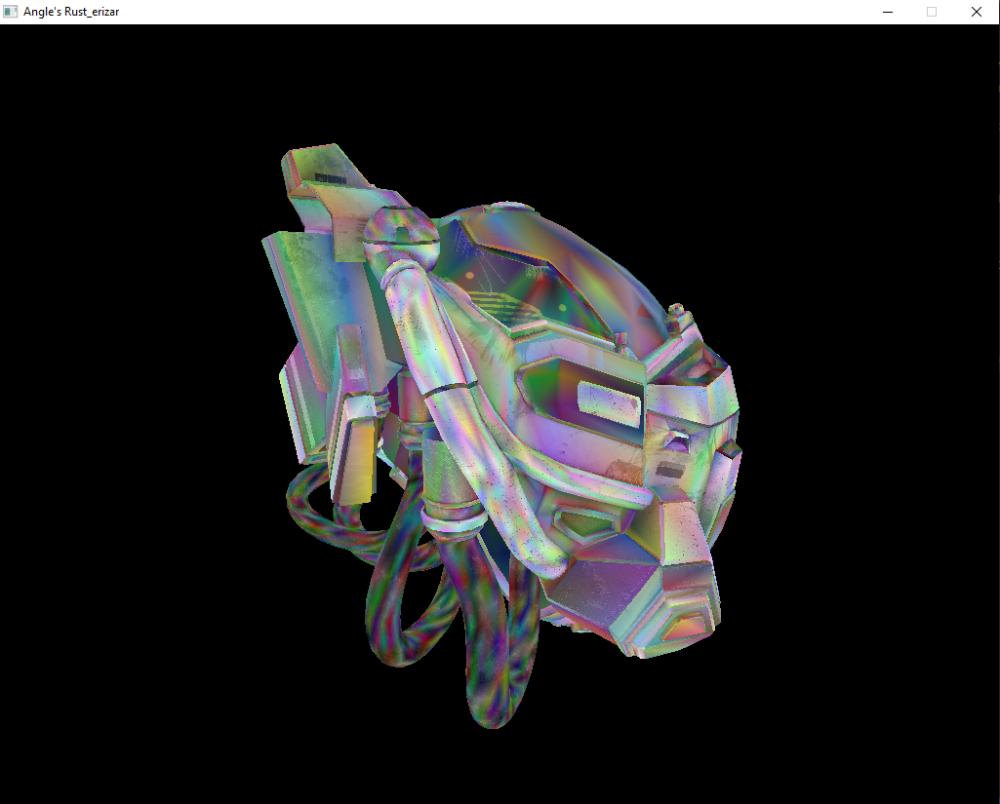
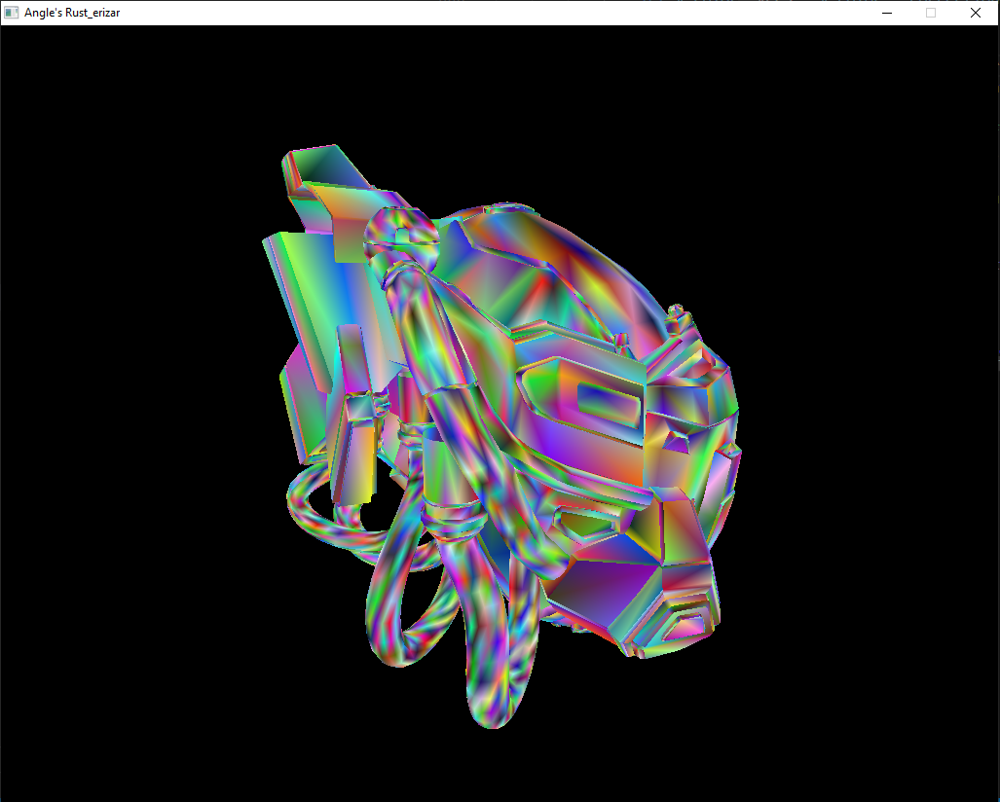
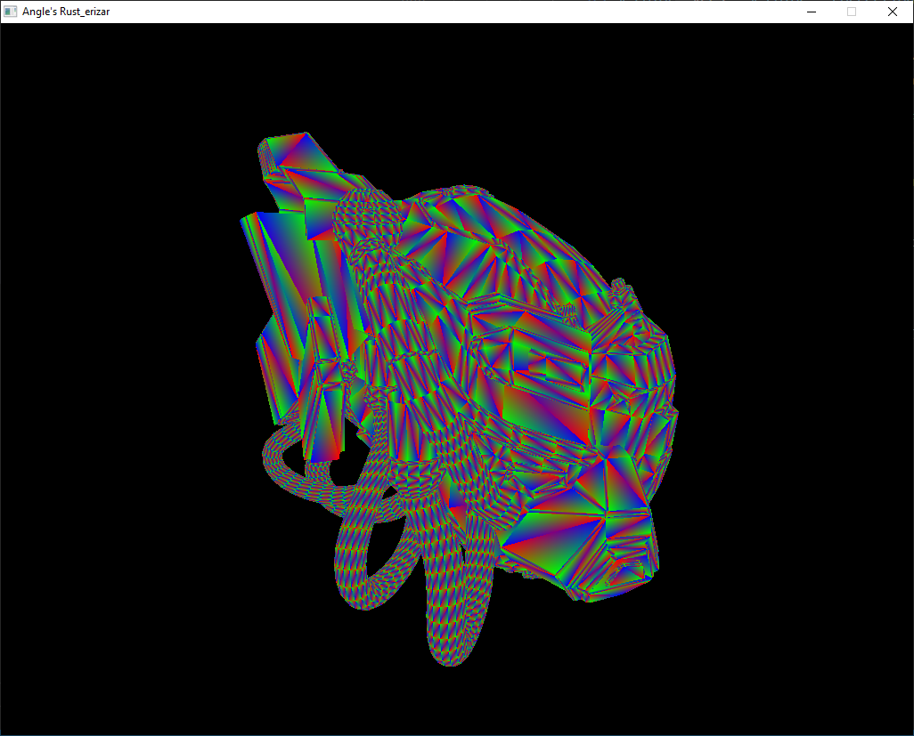
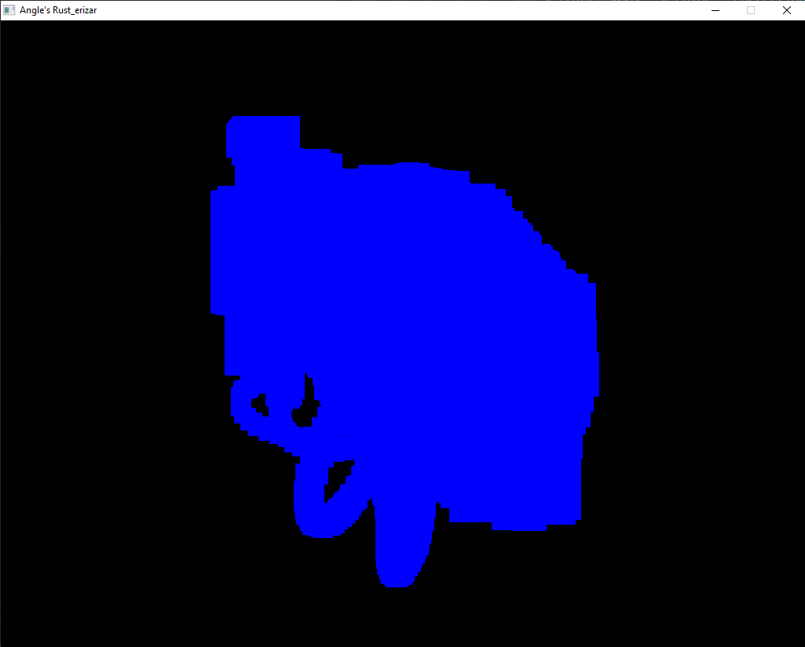
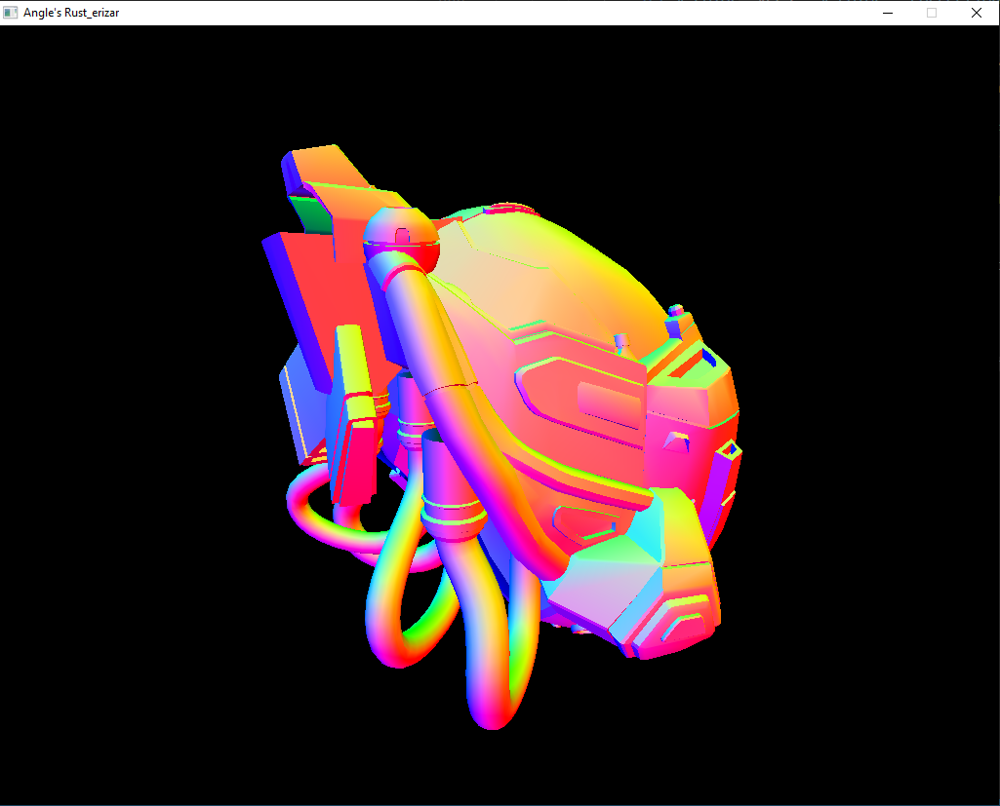
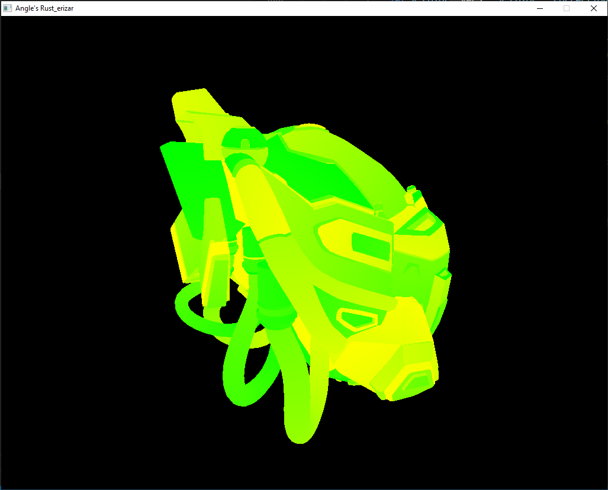

## Showcase
### Images:
#### Picture of all Render Modes of the PBR Helmet:

- Texture:

- Textures + Vertex Colors

- Vertex Colors

- Barycentric coordinates

- AABBs

- Normals

- UVs

### Videos:
#### Render Modes Showcase

#### Multithreaded Sponza!

#### Basic Scene

#### Mesh Culling Showcase

#### Basic Geometry Scene

